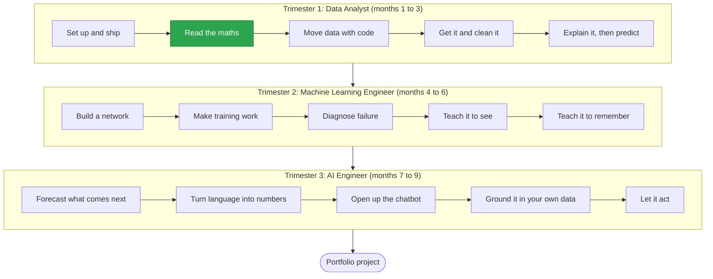

# Holberton School Machine Learning

Model solutions for the Holberton School Machine Learning programme.

This repository follows the programme from the first week to the last. Every project you meet on the intranet has a home here, organised the same way the programme is: by trimester, by topic, and by project.

> **Try every task yourself before you open a solution.** A solution you read teaches you much less than one you struggled with first. Use this repository to check your work and to see a clean way of doing it, not to skip the thinking.

## The path

Nine months, three trimesters, fifteen milestones. Each trimester builds on the one before it.



Green milestones have solutions in this repository. The rest open as the cohort reaches them.

| Trimester | You arrive able to... | You leave able to... |
|-----------|-----------------------|----------------------|
| 1. Data Analyst | write some Python | take a messy dataset and produce an answer you can defend |
| 2. Machine Learning Engineer | call a model | build one, train it properly, and explain why it fails when it does |
| 3. AI Engineer | train models | build products on top of them that other people can use |

## How the repository is organised

```
holbertonschool-machine_learning/
├── README.md               <- you are here: the whole programme
└── math/
    ├── README.md           <- why maths, and what is inside
    └── linear_algebra/
        ├── README.md       <- goals, tasks, and key ideas for the project
        └── 0-*.py          <- one file per task
```

Four rules keep it easy to navigate:

1. **One directory per topic.** For example `math/`.
2. **One subdirectory per project.** For example `math/linear_algebra/`.
3. **One file per task,** named with the task number first so files sort in order.
4. **Every directory has a README** that says what it contains and why it matters.

When you build your own repository, organise it the same way. A reviewer should be able to find any task in a few seconds.

## Environment

| Tool | Version |
|------|---------|
| OS | Ubuntu 22.04 LTS |
| Python | 3.10 |
| Style checker | pycodestyle |
| Main libraries | NumPy, pandas, scikit-learn, TensorFlow (added as the programme reaches them) |

## Code conventions

Every Python file in this repository:

- starts with `#!/usr/bin/env python3`
- passes `pycodestyle` with no warnings
- has a docstring for the module and for every function and class
- is executable (`chmod +x file.py`)
- ends with a new line

## Running a task

```bash
cd math/linear_algebra
./0-main.py
```

Each project README lists its tasks and what each one does.