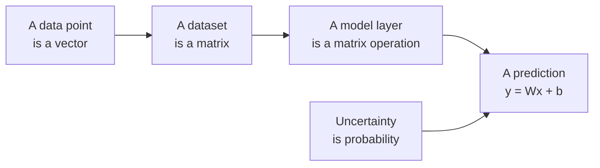

# Math

Machine learning models are written in the language of maths. This directory teaches you to read that language.

The goal is not to pass a maths exam. The goal is to look at a formula like `y = Wx + b` and know what it is doing: what shape each piece has, what the multiplication means, and what comes out the other end.

## From numbers to models

A house described by its size, rooms and age is a vector of three numbers. A thousand houses stacked together form a matrix. A model multiplies that matrix by its weights to make predictions. Probability tells you how much to trust them.

## Projects

| Project | What you learn | Status |
|---------|----------------|--------|
| [linear_algebra](./linear_algebra) | Vectors, matrices, shapes, and the operations models are built from | Available |
| probability | Distributions, uncertainty, and reasoning about chance | Coming next |

## Where you will meet this again

Every idea here comes back later in the programme. That is why it is worth learning properly now.

| Idea from this directory | Where it comes back |
|--------------------------|---------------------|
| Matrix multiplication | Every layer of every neural network (Trimester 2) |
| Shapes and transpose | Debugging shape errors, the most common bug in ML code |
| Dot product | Measuring similarity between embeddings (Trimester 3) |
| Axes (rows and columns) | Grouping and aggregating data with NumPy and pandas |
| Probability | Loss functions and model confidence |

## How to work through it

1. Read the project README first. It tells you the goal before you start.
2. Solve each task by hand on paper for a tiny example, then write the code.
3. Test with your own inputs, not only the ones given.
4. Only then compare with the solution here.
