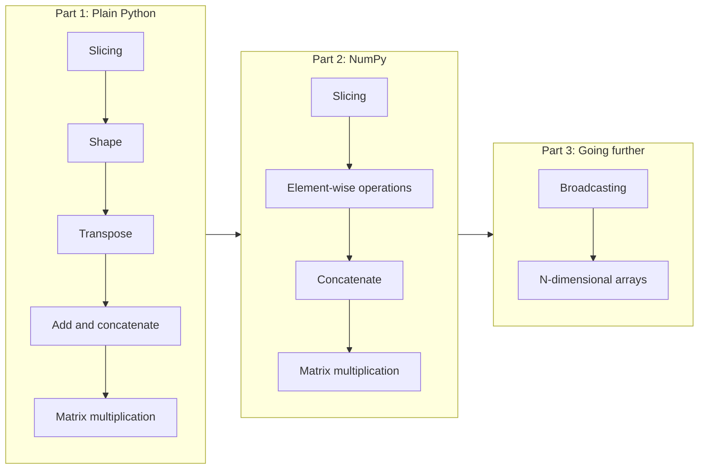
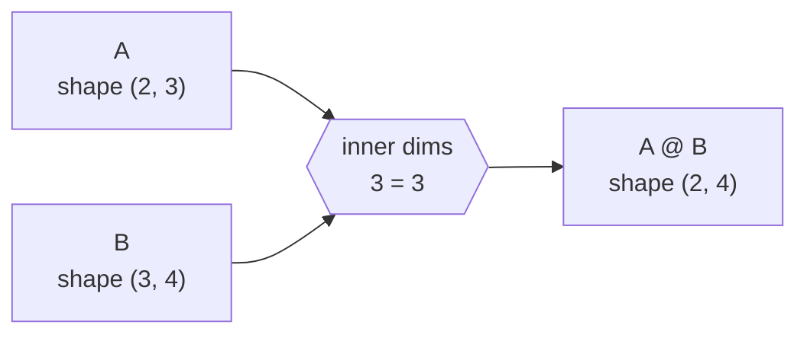

# Linear Algebra

Vectors and matrices are how a computer holds data, and matrix operations are how a model turns data into predictions. In this project you build those operations yourself, first with plain Python and then with NumPy.

## Goal

By the end of this project you can take any two arrays, say what shape they have, say whether they can be combined, and predict the shape of the result before you run the code.

## Learning objectives

After this project you can explain, without looking anything up:

- what a vector, a matrix and a tensor are
- what the shape of an array is, and how to find it
- what a transpose does
- the difference between element-wise operations and matrix multiplication
- what a dot product computes
- what an axis is, and what `axis=0` and `axis=1` mean
- how to slice an array
- why NumPy is faster than Python lists, and what broadcasting does

## The path through the project

The project goes from doing everything by hand to letting NumPy do it for you. Doing it by hand first means NumPy is never a black box.

## The one rule to remember

Two matrices can be multiplied only when the inner dimensions match. The result takes the outer dimensions.

If you can predict the output shape before running the code, you understand the operation.

## Key ideas at a glance

| Idea | Plain Python | NumPy |
|------|--------------|-------|
| Shape | count nested lists | `arr.shape` |
| Transpose | swap rows and columns with a loop | `arr.T` |
| Element-wise add | loop over pairs | `a + b` |
| Matrix multiply | three nested loops | `a @ b` |
| Join along rows | `m1 + m2` | `np.concatenate((a, b), axis=0)` |
| Join along columns | extend each row | `np.concatenate((a, b), axis=1)` |

`axis=0` runs down the rows. `axis=1` runs across the columns.

## Requirements

- Ubuntu 22.04, Python 3.10, NumPy
- Every file starts with `#!/usr/bin/env python3`, is executable, and ends with a new line
- Code passes `pycodestyle`
- Every module and function has a docstring
- Unless a task says otherwise, `import numpy as np` is the only import allowed

## Tasks

Tasks 0 to 9 use plain Python only. Tasks 10 to 14 solve the same kinds of problems with NumPy. Compare each NumPy solution with its plain Python version: the logic is the same, only the tool changes.

### Part 1: Plain Python

| # | File | What it does |
|---|------|--------------|
| 0 | [`0-slice_me_up.py`](./0-slice_me_up.py) | Slices lists to get the first two, the last five, and the 2nd to 6th elements |
| 1 | [`1-trim_me_down.py`](./1-trim_me_down.py) | Extracts the middle columns of a matrix |
| 2 | [`2-size_me_please.py`](./2-size_me_please.py) | `matrix_shape(matrix)` returns the shape of a matrix as a list of integers |
| 3 | [`3-flip_me_over.py`](./3-flip_me_over.py) | `matrix_transpose(matrix)` returns the transpose of a 2D matrix |
| 4 | [`4-line_up.py`](./4-line_up.py) | `add_arrays(arr1, arr2)` adds two arrays element-wise, or returns `None` if their shapes differ |
| 5 | [`5-across_the_planes.py`](./5-across_the_planes.py) | `add_matrices2D(mat1, mat2)` adds two 2D matrices element-wise, or returns `None` if their shapes differ |
| 6 | [`6-howdy_partner.py`](./6-howdy_partner.py) | `cat_arrays(arr1, arr2)` joins two arrays into a new one |
| 7 | [`7-gettin_cozy.py`](./7-gettin_cozy.py) | `cat_matrices2D(mat1, mat2, axis=0)` joins two 2D matrices along an axis, or returns `None` if they cannot be joined |
| 8 | [`8-ridin_bareback.py`](./8-ridin_bareback.py) | `mat_mul(mat1, mat2)` multiplies two matrices, or returns `None` if the inner dimensions do not match |

### Part 2: NumPy

| # | File | What it does |
|---|------|--------------|
| 9 | [`9-let_the_butcher_slice_it.py`](./9-let_the_butcher_slice_it.py) | Slices a NumPy matrix to get its middle rows, middle columns, and bottom-right corner |
| 10 | [`10-ill_use_my_scale.py`](./10-ill_use_my_scale.py) | `np_shape(matrix)` returns the shape of a NumPy array as a tuple |
| 11 | [`11-the_western_exchange.py`](./11-the_western_exchange.py) | `np_transpose(matrix)` returns the transpose of a NumPy array |
| 12 | [`12-bracin_the_elements.py`](./12-bracin_the_elements.py) | `np_elementwise(mat1, mat2)` returns the element-wise sum, difference, product and quotient |
| 13 | [`13-cats_got_your_tongue.py`](./13-cats_got_your_tongue.py) | `np_cat(mat1, mat2, axis=0)` joins two NumPy arrays along an axis |
| 14 | [`14-saddle_up.py`](./14-saddle_up.py) | `np_matmul(mat1, mat2)` multiplies two NumPy matrices |

## Resources

- [NumPy: the absolute basics for beginners](https://numpy.org/doc/stable/user/absolute_beginners.html)
- [3Blue1Brown: Essence of Linear Algebra](https://www.3blue1brown.com/topics/linear-algebra), watch chapters 1 to 4 before starting