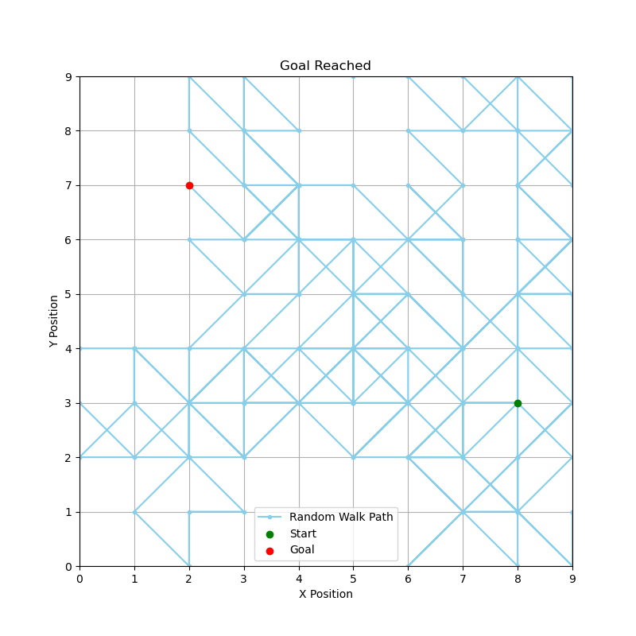

## Random Walker in a Grid

#### **Project Description**  
This project focuses on simulating a random walk in a 2D grid using **Numpy** for random number generation and **Matplotlib** for visualization. The goal is to apply basic probability concepts and explore how random movements behave over a defined space, reinforcing the relationship between random steps and spatial distributions. You will also calculate and analyze statistics related to the walk.

#### **Learning Objectives**  
- Use **Numpy** to generate random steps and perform vectorized operations.  
- Apply probability to simulate random movements in a constrained environment.  
- Visualize spatial trajectories using **Matplotlib**.  
- Explore statistics like the average number of steps and their distributions.  

---

### **Project Requirements**  

1. **Simulation Setup**  
   - Create a 2D grid of fixed size (e.g., `10x10`).
   - Define a **start position** and a **goal position** in the grid.  
   - Use **Numpy** to simulate random steps in both the x and y directions, ensuring the walker remains within the grid bounds.

2. **Random Walk Logic**  
   - Implement a function to simulate a **random walk**:  
     - At each step, the walker can move in one of three ways in each direction: `-1` (left/down), `0` (no movement), or `+1` (right/up).  
     - Ensure the walker does not leave the grid (use clamping or boundary conditions).  
     - Stop the simulation when either:  
       a) The walker reaches the **goal position**, or  
       b) A maximum number of steps is reached (e.g., `1000 steps`).

3. **Path Tracking**  
   - Track all positions visited during the walk in a list or array for later visualization.

4. **Visualization**  
   - Plot the path taken by the walker on the grid using **Matplotlib**:  
     - Highlight the **start position** (green) and the **goal position** (red).  
     - Use a line plot to show the trajectory.  

5. **Statistics**  
   - Calculate the **number of steps** required to reach the goal or the **total steps** taken if the goal was not reached.  
   - Run the simulation multiple times (e.g., `100 trials`) and:  
     - Track the number of steps taken in each trial.  
     - Visualize the **distribution of steps** using a histogram.

6. **Stretch Goals (Optional)**  
   - Randomize the start and goal positions for each trial.  
   - Experiment with larger grid sizes and analyze how it affects the results.  
---

#### **Visualization Example: Random Walk in a Grid**

Below is an example visualization of a **Random Walk** in a 10x10 grid. The blue line shows the random path taken from the starting position (green) to the goal (red). This illustrates how randomness can lead to unpredictable yet fascinating trajectories!  

  

