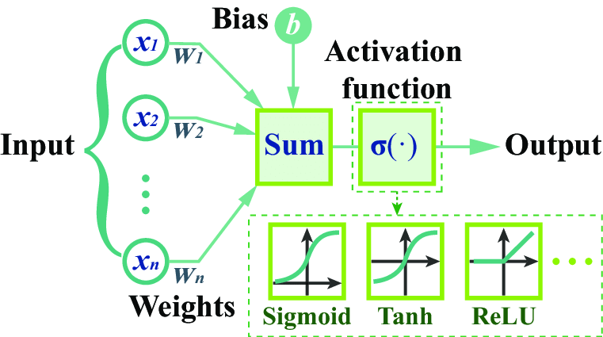
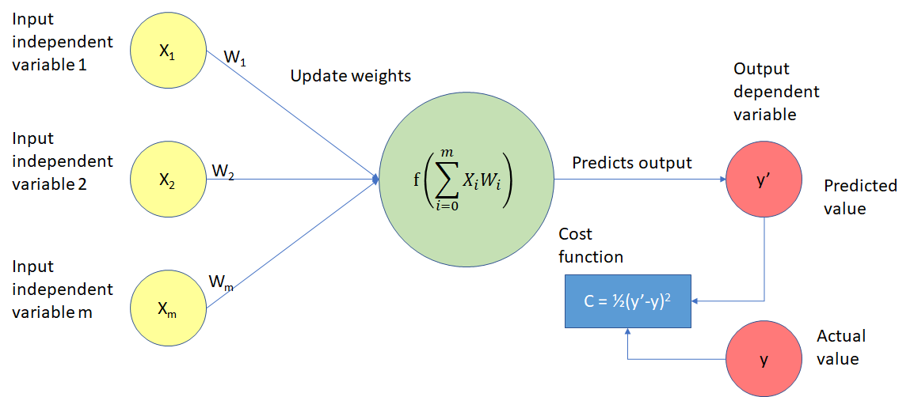

# Read Me

## Feed Forward Neural Networks

Feedforward neural networks are fundamental structures in deep learning. They consist of interconnected layers of neurons, where information flows in one direction, from the input layer through hidden layers to the output layer. Each neuron applies a weighted sum of inputs, followed by an activation function, to produce an output.

The essence of feedforward neural networks lies in their ability to learn complex patterns and relationships in data, making them powerful tools for tasks like classification, regression, and function approximation. They excel in handling large datasets and can automatically extract features from raw data, reducing the need for manual feature engineering.

### Weights, Bias, Activation Function

####  Weights
Weights in neural networks are parameters associated with the connections between neurons. They determine the strength of influence that each input feature has on the neuron's output. The weights are adjusted during training to minimize the difference between predicted and actual outputs.

#### Bias

Bias in neural networks is an additional parameter added to each neuron. It allows the neuron to output nonzero values even when all input features are zero, providing flexibility to the model. The bias term is also learned during training and helps shift the activation function, influencing the output of the neuron.

#### Activation function

Activation functions in neural networks introduce nonlinearity to the model by transforming the weighted sum of inputs and bias into the output of the neuron. They determine whether the neuron should be "activated" (produce a high output) or not (produce a low output) based on the input. 

### Forward Propagation

The primary aim of forward propagation in a neural network is to process input data through the network's layers, ultimately producing predictions or outputs. 

More practically, during forward propagation we **compute the activation of each neuron in the network**. 

This involves 
- calculating a weighted sum of the input data along with a bias term for each neuron
- applying an activation function to produce the neuron's output. 

The computed activations are passed forward through the network to generate predictions or outputs.

The sigmoid function is a commonly used activation function in neural networks. It is a mathematical function that maps any input value to a value between 0 and 1. The formula for the sigmoid function is:

$$
sigmoid(z) = \frac{1}{1 + e^{-z}}
$$

In the `forward_prop` method, `z` is calculated as the dot product of the weights `self.W` and input data `X`, plus the bias `self.b`. The bias is a scalar value added to each neuron's weighted inputs, which helps to shift the activation function to the left or right. Mathematically, this can be represented as:

$$
z = W \cdot X + b
$$

The forward_prop method returns the private attribute `self.__A`, which represents the activation of the neuron. By updating `self.__A` in the `forward_prop` method, we are able to pass the activation value to subsequent layers in the neural network during the forward propagation process.

### Cost Function

In logistic regression, the goal is to classify input data into one of two categories (0 or 1). The output of the logistic regression model is a probability value between 0 and 1, which represents the likelihood that the input belongs to the positive class (1).

To train the logistic regression model, we need to define a cost function that measures the error between the predicted probabilities and the actual labels. The cost function is then minimized using an optimization algorithm to update the model's parameters (weights and bias) such that the predicted probabilities become closer to the actual labels.

The cost function used in logistic regression is called the binary cross-entropy loss function, which is defined as follows:

$$
loss = -((Y * log(A)) + ((1 - Y) * log(1 - A)))
$$

The cost function is then defined as the average of the loss function over all training examples

$$
J(w,b) = (1/m) * ∑(loss(y^{i}, a^{i})), i=1 \to m
$$

### Evaluate Neural Network

To evaluate a neuron model, we follow a simple process. First, we use the model to predict outcomes for a given set of input data. Then, we compare these predictions with the actual outcomes to assess how accurate the model is. Finally, we compute a measure of how well the model performed, typically referred to as the cost or loss.

In our case

- We first compute the activations of the neuron for the given input data X using the forward_prop method. 

- Then, we calculate the cost of the model's predictions by comparing the computed activations A with the actual labels Y using the cost method.

- Finally, we make predictions based on the activations: 
    - if an activation is greater than or equal to 0.5, we predict a positive class (1),
    - otherwise, we predict a negative class (0). 
    
The function returns both the predictions and the computed cost, providing insights into the model's performance.

### Gradient Descent

The goal of the gradient descent algorithm is to minimize the loss function and find the optimal parameters (weights and bias) for a given neural network. It does this by iteratively updating the parameters in the direction of the steepest decrease of the loss function.

Key steps of the gradient descent algorithm:

1. Calculate the derivative of the loss function with respect to the activated output (`dz`), representing the error in the predictions.

2. Compute the derivatives of the loss function with respect to the weights (`d__W`) and bias (`d__b`), indicating how much each parameter contributes to the error.

3. Update the weights and bias using one step of gradient descent, adjusting them in the opposite direction of the gradient multiplied by the learning rate (`alpha`).

4. Repeat these steps iteratively until convergence, gradually minimizing the loss function and improving the model's performance.

    
    
### Train a Neural Network

The main goal of training a neural network is to iteratively adjust its parameters (weights and bias) to minimize the prediction error and improve its performance. 

The training process involves repeatedly performing forward propagation to compute predictions, followed by gradient descent to update the parameters based on the prediction error. 

This iterative process continues for a specified number of iterations, gradually refining the model's predictions. Finally, the training concludes with an evaluation of the trained model's performance on the training data, providing insights into its accuracy and effectiveness.